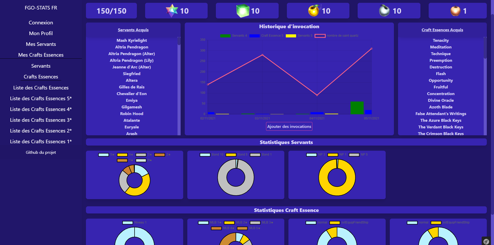
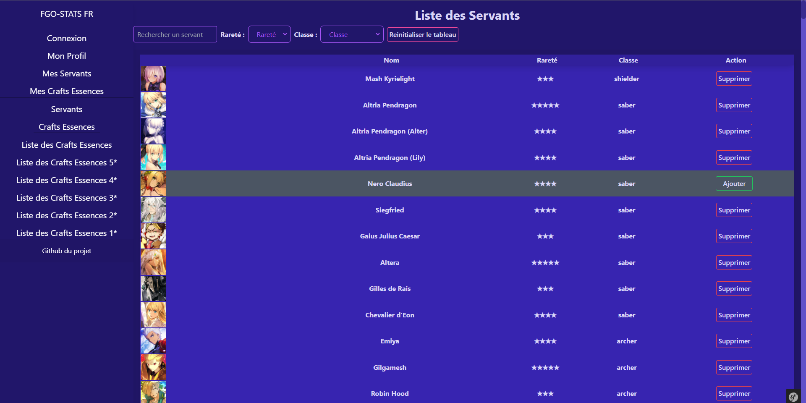
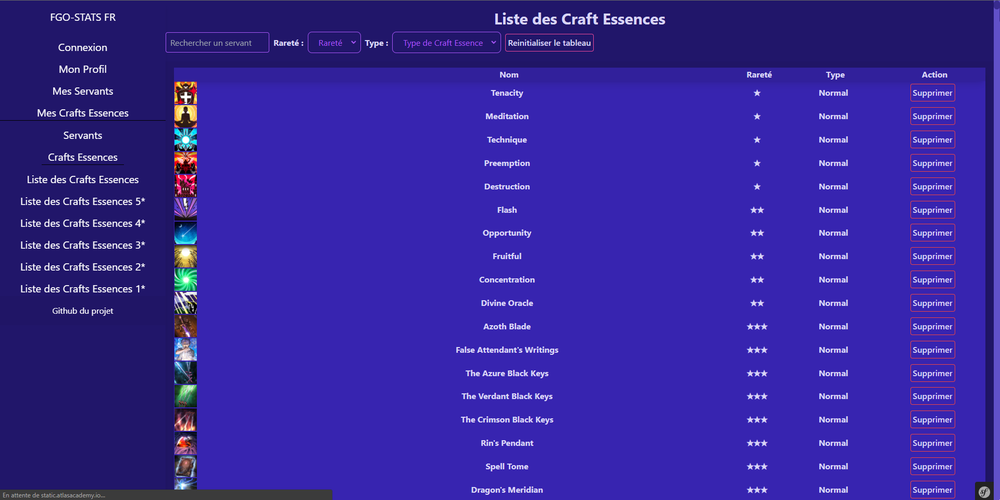
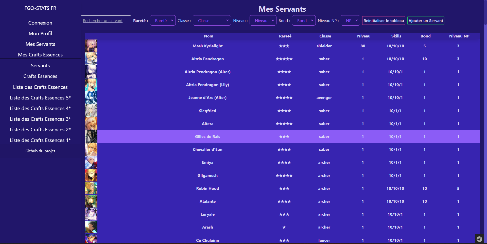
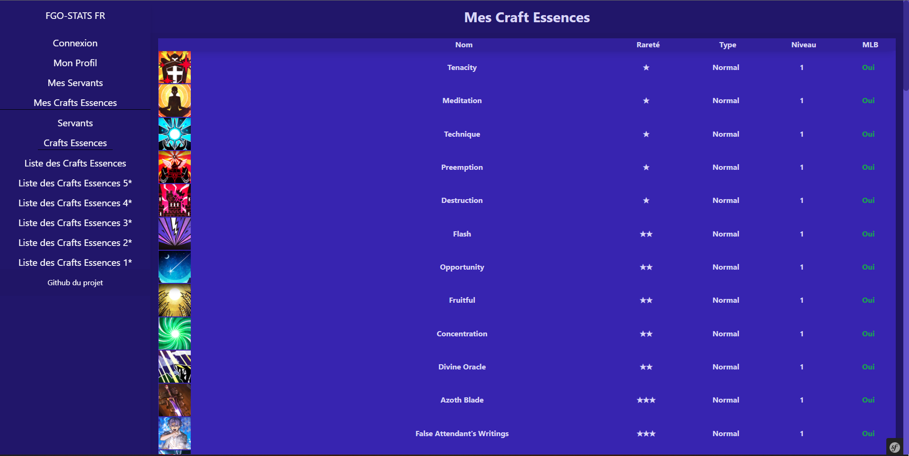
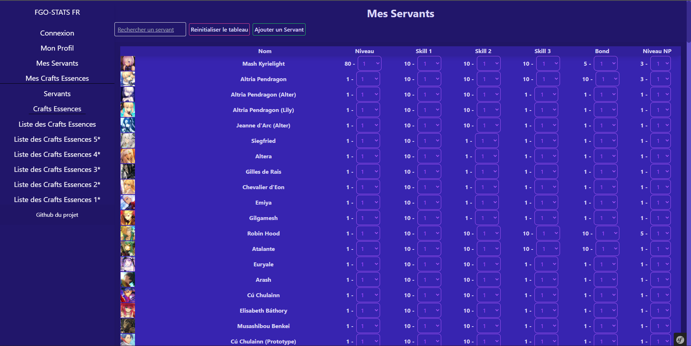
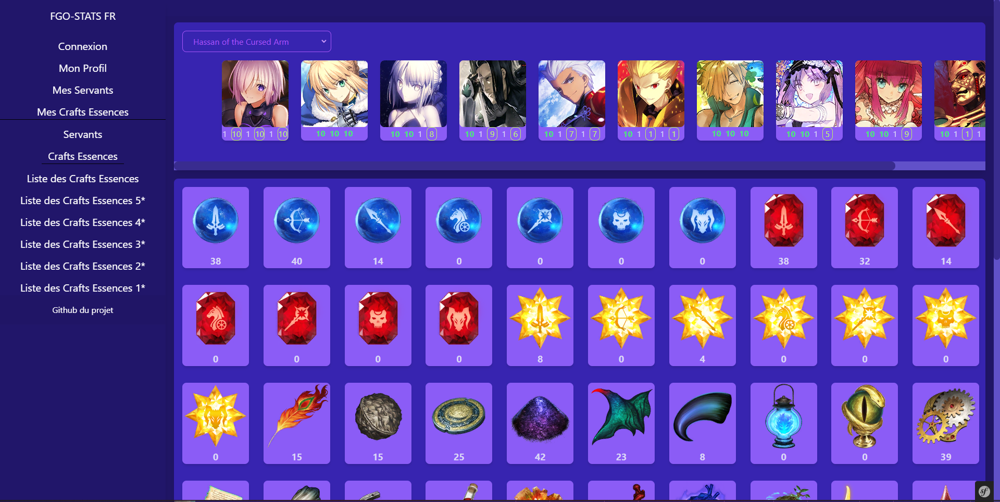

# fgostatsfr

Ce site a été réaliser avec les langages :
  - PHP
  - HTML
  - CSS
  - Javascript

Avec les frameworks : 
  - Symfony 5
  - Tailwindcss
  - JQuery

Pour récupèrer toutes les informations du jeu, j'ai utilisé l'API de AtlasAcademy : https://api.atlasacademy.io/rapidoc

Ce site est basé sur le jeu mobile Fate/Grand Order.
Il vas permettre a un utilisateur de suivre sa progression dans le jeu.
Le site dispose de : 
  - une page d'enregistrement
  - une page de connexion,
  - une page "Profil", permettant a l'utilisateur de consulter des statistiques relatives a son compte
  - une page "liste servant", affichant tout les servants existant en jeu, permettant a l'utilisateur d'ajouter rapidement un personnage qu'il n'as pas
  - une page "liste craft essences", affichant toutes les crafts essences existantes en jeu, permettant a l'utilisateur d'ajouter rapidement une craft essence qu'il n'as pas
  - une page "collection-servant", affichant tout les servants que l'utilisateur as obtenus, avec leurs niveaux, skills, np, bond
  - une page "collection-ce", affichant toutes les crafts essences que l'utilisateur as obtenus, avec leurs niveaux, et si la CE est MLB ou non
  - une page "modification-rapide-servants", permettant a l'utilisateur de modifier des informations rapidement pour chaque servants qu'il as obtenus
  - une page "planificateur", affichant les matériaux requis pour chaque personnages selectionnés
  
  
Page "Profil"  :

Page "Liste servants" :

Page "Liste CE" :

Page "collection-servant" :

Page "collection-ce" :

Page "modification-rapide-servants" :

Page "planificateur" :

Le site est encore en construction, il y a des bugs a corriger et des fonctionnalitées a ajouter :

Fonctionnalitées a ajouter : 
  - Historique d'invocation
  - Planificateur de Saint Quartz
  - A voir...
